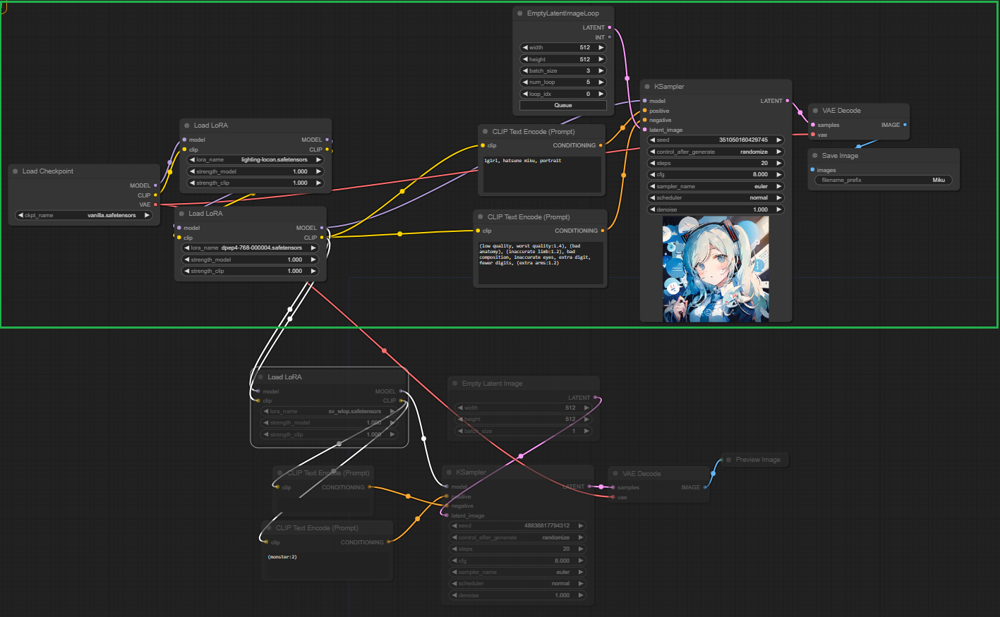

# ComfyUI Loopchain

A collection of nodes which can be useful for animation in ComfyUI. The main focus of this extension is implementing a mechanism called loopchain.

A loopchain in this case is the chain of nodes only executed repeatly in the workflow. If a node chain contains a loop node from this extension, it will become a loop chain.

Here is an example. Only the chain in the green box is enabled and in a loop as it contains `EmptyLatentImageLoop`.

Still doesn't understand? Play around with [this workflow](./loopchain_example.json) then.

# Nodes
* EmptyLatentImageLoop
* ImageStorageImport
* ImageStorageExport
* ImageStorageExportLoop