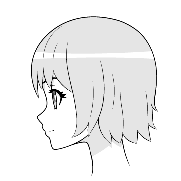

# ComfyUI Loopchain

A collection of nodes which can be useful for animation in ComfyUI. The main focus of this extension is implementing a mechanism called loopchain.

A loopchain in this case is the chain of nodes only executed repeatly in the workflow. If a node chain contains a loop node from this extension, it will become a loop chain.

# Example
TODO: Detailed explaination.

First, install https://github.com/Fannovel16/ComfyUI-Frame-Interpolation.

Second, make a folder named `heads` inside of `ComfyUI/inputs` then put these two images into it.

Then load [this workflow](./full_loopchain.json).

https://github.com/Fannovel16/ComfyUI-Loopchain/raw/main/demo.mp4

# Nodes
* EmptyLatentImageLoop
* ImageStorageImport
* ImageStorageExport
* ImageStorageExportLoop
* ImageStorageImport
* ImageStorageExportLoop
* ImageStorageReset
* FolderToImageStorage (need a folder in `input` instead of an image)
* LatentStorageImport
* LatentStorageExportLoop
* LatentStorageReset